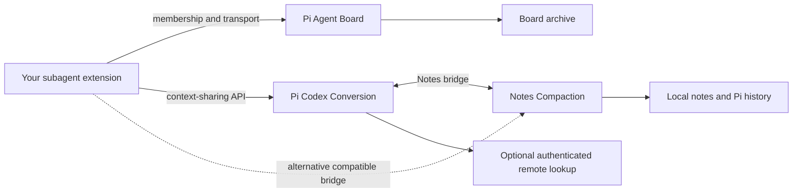
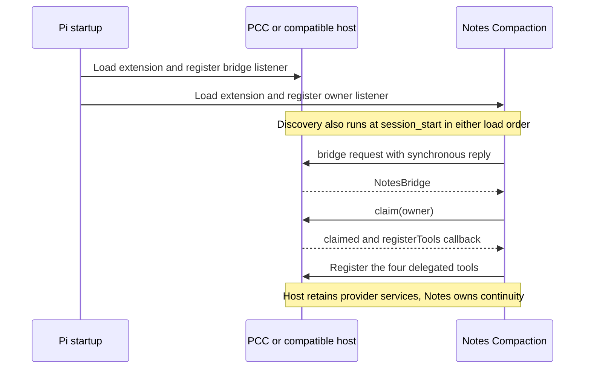
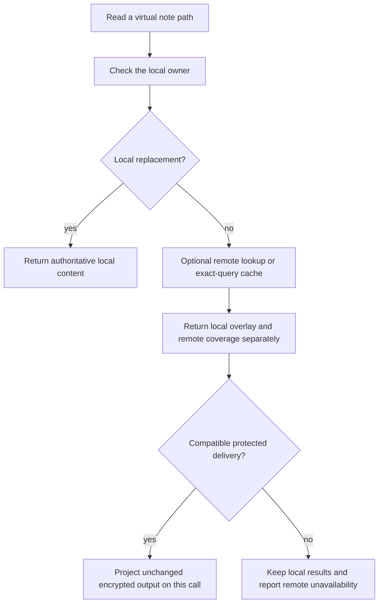
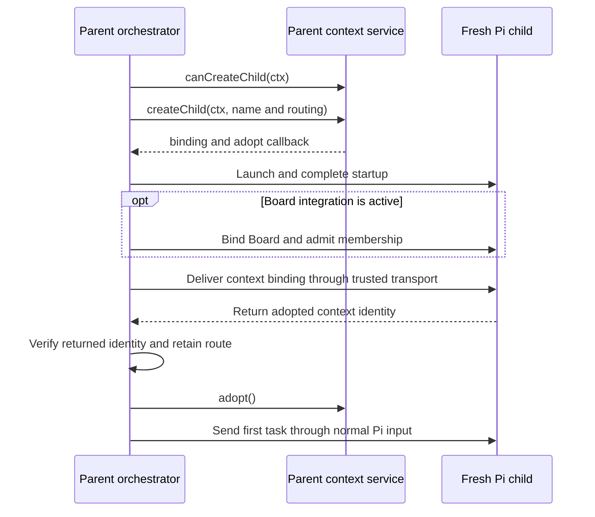

# Extension integration APIs

Use the pieces you need. Pi Agent Board can share discussions between agents without Shepherdr. Notes Compaction can maintain a session without PCC or Shepherdr. An orchestrator can connect those capabilities to its own agent lifecycle through the contracts below.

This guide covers extension-to-extension APIs: registration, ownership, identity, routing, lifecycle and results. It is for people building Pi extensions, including people using an agent to build one. It does not require adopting the whole package collection.

The examples are integration fragments, not a replacement orchestrator. Your extension still supplies its own process launch, authenticated transport and membership policy. Source links identify the exact TypeScript contracts. Package READMEs cover installation and user controls.

## Choose an integration

| What you want | Load | What your extension supplies |
|---|---|---|
| A board in one Pi session | [Pi Agent Board](../packages/pi-agent-board/README.md) | Nothing |
| A board shared by your subagents | Pi Agent Board in each participating session | A `BoardAdapter`, member admission and authenticated routes |
| Local notes, history and context rollover | [Notes Compaction](../packages/pi-notes-compaction/README.md) | Nothing |
| Shared notes with PCC installed | Notes Compaction and [PCC](../packages/pi-codex-conversion/README.md) in the participants | PCC context-sharing discovery, child binding and a family router |
| Shared notes without PCC | Notes Compaction and your own compatible Notes bridge | Identity, routing, ownership handoff and any optional provider services you choose to implement |
| A Pi tool usable from Code or Notebook | A normal Pi tool, with PCC present | Usually no extra registration. Use the Code Mode API for custom behavior |
| A local tool callable by Grok voice | [Grok Realtime](../packages/pi-grok-realtime/README.md) | A `GrokToolDefinition` |
| A miniapp in GipPity's browser UI | [GipPity Control](../packages/pi-gippity-control/README.md), or PCC's included GipPity | A static app and a state/event provider |

**Without Shepherdr does not mean without an orchestrator.** Board and Notes do not find arbitrary agents, launch processes, invent membership or authenticate another extension's transport. Shepherdr is one consumer of these APIs, not a required process manager.

Board's adapter is an explicitly exported package API. Notes' lower-level bridge is a documented event protocol, with no separately exported bridge SDK. A custom bridge is possible, but it is more work than connecting the existing PCC context-sharing service. Installing Notes alone does not turn another subagent extension into a shared-notes host.

Board and Notes require Pi 1.1.0 or newer. For the combined PCC/Notes integration described here, use PCC 3.0.49 or newer and Notes Compaction 0.0.3 or newer. Check each package's manifest for its Node.js and peer requirements.



## Public entry points

`pi.extensions` in a package manifest tells Pi what to load. `exports` tells JavaScript which imports resolve. Neither a root extension entrypoint nor a wildcard export is a promise that every implementation module is an integration API.

| Import or protocol | Purpose | Contract |
|---|---|---|
| `@howaboua/pi-agent-board/runtime` | Discover the loaded Board owner | [`runtime.ts`](../packages/pi-agent-board/src/runtime.ts) |
| `@howaboua/pi-agent-board/integration` | Host adapter, envelopes, bindings and briefing helpers | [`integration.ts`](../packages/pi-agent-board/src/integration.ts) |
| `pi-notes-compaction:owner:v1` and `pi-notes-compaction:bridge:v1` | Notes ownership and optional host services | [`bridge.ts`](../packages/pi-notes-compaction/src/bridge.ts) |
| `@howaboua/pi-codex-conversion/context-sharing` | Family identity, binding and routed notes/history | [`context-sharing.ts`](../packages/pi-codex-conversion/src/context-sharing.ts) |
| `@howaboua/pi-codex-conversion/code-mode` | Custom nested-tool registration | [`code-mode.ts`](../packages/pi-codex-conversion/src/code-mode.ts) |
| `@howaboua/pi-codex-conversion/code-mode-hooks` | Nested-call preflight and completion | [`code-mode-hooks.ts`](../packages/pi-codex-conversion/src/code-mode-hooks.ts) |
| `@howaboua/pi-codex-conversion/code-mode-preflight` | Supported older preflight import | [`code-mode-preflight.ts`](../packages/pi-codex-conversion/src/code-mode-preflight.ts) |
| `@howaboua/pi-codex-conversion/developer-messages` | Developer delivery, prepared kickoffs and context briefings | [`developer-messages.ts`](../packages/pi-codex-conversion/src/developer-messages.ts) |
| `@howaboua/pi-codex-conversion/apply-patch-display` | Custom patch presentation | [`apply-patch-display.ts`](../packages/pi-codex-conversion/src/apply-patch-display.ts) |
| `@howaboua/pi-codex-conversion/realtime-voice` | Voice announcements | [`realtime-voice.ts`](../packages/pi-codex-conversion/src/realtime-voice.ts) |
| `@howaboua/pi-grok-realtime/tools` | Register local Grok voice tools | [`tools.ts`](../packages/pi-grok-realtime/src/tools.ts) |
| `@howaboua/pi-gippity-control/remote-app` | Register a browser miniapp | [`remote-app.ts`](../packages/pi-gippity-control/src/voice/lan/remote-app.ts) |
| `@howaboua/pi-gippity-control/lan-service` | Request the session's LAN service | [`service.ts`](../packages/pi-gippity-control/src/voice/lan/service.ts) |

The GipPity root also exports its remote-app, LAN-service and realtime-announcement helpers. PCC's root has additional [tool and tool-selection helpers](#additional-pcc-root-exports).

When a dependency is optional, load its integration module lazily and handle its absence. Do not treat an arbitrary import or delivery error as an absent dependency. Once a helper has accepted an operation, a later failure is not permission to silently repeat it through another route.

## Three identifiers to keep separate

| Identity | Meaning | Owner |
|---|---|---|
| Pi session ID | One persisted Pi session | Pi |
| Board binding | Membership in a particular board and its owning archive | Board and your membership adapter |
| Context identity | A notes/history family and one agent path within it | PCC context sharing, or your compatible host bridge |

Board names and context names can differ for the same agent. Never derive one from the other. Keep the bindings returned by each subsystem.

A context window is not an agent identity. Notes can open another window while preserving the session's family membership. A new root session or fork must not inherit another live agent's identity merely because it shares a working directory.

Your transport owns the association between a trusted peer, its current Pi session and its saved binding. A model-provided path, process ID, route string or JSON object is not authentication.

## Pi Agent Board

### Discover the owner

Load the Board extension normally. An integration calls `discoverBoard` during its own initialization. Discovery works in either extension load order and attaches once. It does not create a board owner.

```ts
import type {
  ExtensionAPI,
  ExtensionContext,
} from "@earendil-works/pi-coding-agent";
import {
  discoverBoard,
  type BoardRuntime,
} from "@howaboua/pi-agent-board/runtime";
import type {
  BoardAdapter,
  BoardEnvelope,
} from "@howaboua/pi-agent-board/integration";

// The caller implements and authenticates the transport behind adapter.
export function connectBoardHost(pi: ExtensionAPI, adapter: BoardAdapter) {
  let board: BoardRuntime | undefined;
  discoverBoard(pi, runtime => {
    runtime.attach(adapter);
    board = runtime;
  });

  return {
    receive(ctx: ExtensionContext, envelope: BoardEnvelope, signal?: AbortSignal) {
      if (!board) throw new Error("Board is not available in this session");
      return board.handle(ctx, envelope, signal);
    },
  };
}
```

Authenticate and admit the peer before calling `receive`. The TypeScript annotation is not runtime authorization.

`discoverBoard` returns no disposer. It removes its discovery listener on `session_shutdown`. `runtime.attach(adapter)` accepts one adapter and rejects a second. `acquireBoard(pi)` is also exported, but it is the Board extension's owner-creation function. Consumer extensions should discover the explicitly loaded owner instead of creating a competing one.

### Implement `BoardAdapter`

| Method | Contract |
|---|---|
| `request(route, request, signal?)` | Return `Promise<unknown>` from an authenticated peer request. `route` is a host-owned string |
| `commitDirectory(own, directory, caller, request)` | Apply an admitted `board-register` or `board-unregister` and persist the resulting membership. Returns the host's result |
| `routeNotice(ctx, request, signal?)` | Return `Promise<unknown>` after routing `board-notify` toward its target |
| `propagateEnabled(ctx, enabled)` | Return `Promise<void>` after forwarding the root's enablement change to children |
| `briefing(member, population)` | Optional string guidance. `population` is `empty`, `populated` or `unavailable` |

The runtime owns storage operations, settings, subscriptions, tool registration, request validation and current-turn notification checks. Your adapter owns member admission, transport and route persistence.

Use `runtime.execute(ctx, input, requestId)` for local Board operations. It returns a promise of the operation's result. `runtime.handle(ctx, envelope, signal?)` is the peer receiver. Preserve `requestId` when retrying the same operation. A lost response can follow a successful write, so do not retry a post with a fresh ID just to restore presentation.

### Bindings and envelopes

`BoardBinding` has `protocol: 1`, `boardId`, `rootSessionId`, `sessionId`, `agentName`, `ownerFolder`, `databasePath`, `enabled` and optional `upstream`. The IDs are UUID-shaped strings. Agent paths use `/root` and child segments. `upstream` is opaque to Board.

The integration module exports `BindingSchema`, `parseBinding`, `binding`, `members`, `children`, `saveBinding`, `saveMember`, `removeMember`, `saveChild` and `rootBoardSetting`. These operate on Pi-owned session entries. They do not authenticate a peer or create a process.

The [`BoardEnvelope` union](../packages/pi-agent-board/src/protocol.ts) contains these operations:

| Operation | Fields beyond `operation` | Purpose |
|---|---|---|
| `board-bind` | `binding` | Adopt a fresh child's board membership |
| `board-register` | `caller`, `member` | Admit a member at the owner |
| `board-unregister` | `caller`, `member` | Remove an admitted member |
| `board-call` | `caller`, `params`, `requestId` | Execute a Board tool operation |
| `board-catchup` | `caller`, `seen` | Retrieve updates not represented by the supplied seen IDs |
| `board-active` | `caller`, `turnId`, optional `previousTurnId` | Report a live turn or clear it with `turnId: null` |
| `board-notify` | `boardId`, `target`, `sessionId`, `turnId`, `notice` | Deliver an update to a particular live turn |
| `board-enabled` | `boardId`, `enabled` | Propagate the root's board setting |

`notice` carries `message_id`, `channel_name`, `author`, `thread_id`, `created_at`, `text_preview`, `n_chars` and `truncated`. `isBoardEnvelope(value)` is a routing discriminator, not full validation. Pass admitted envelopes to `runtime.handle`, which validates them.

For a fresh child, prepare its parent-owned binding, launch Pi, wait for initialization, deliver `board-bind`, verify the returned child identity, register the member at the owner, then retain the route. Binding is allowed only before the first task and before an existing board binding. Resume uses the saved binding. Attachment of an already-used session is a separate host membership operation, not a retry of fresh-child binding.

### Delivery and persistence

Board notifications target a specific running turn. Route them without waking an idle agent. The runtime supplies catch-up at the next prepared turn. A discussion post is not a task assignment.

Archives live at `<owner folder>/.pi/agent-message-board.sqlite`. Existing `shepherdr-board-*` session-entry names are persisted format identifiers, not a requirement to install Shepherdr. Preserve them when reading existing sessions.

The browser viewer is read-only. It is not a membership, transport or posting API. A missing route must remain an explicit failure rather than opening another archive with a similar path.

The integration module also exports `registerContextBriefing`, `recordContextBriefing`, `contextBriefingWindow` and `hasContextRollover`. These support Board's durable guidance across context windows. Their signatures and persistence rules live in [`context-briefing.ts`](../packages/pi-agent-board/src/context-briefing.ts).

See the package's [host integration reference](../packages/pi-agent-board/INTEGRATION.md). Shepherdr's [`board` adapter](../packages/pi-shepherdr/src/board) is a concrete consumer, not a module another orchestrator needs to import.

## Notes Compaction

### Standalone contract

Notes Compaction owns four Pi tools: `notes`, `history`, `new_context` and `get_context_remaining`. It owns checkpoint guidance, note freshness, window markers, rollover and its local response cache. Pi remains the transcript owner. User configuration lives behind `/notes`.

Notes use virtual paths. Relative paths belong to the current agent. Cross-agent paths have the form `/root/<child>/notes/<path>` and require an installed family-routing capability. An independent session's `/root` does not grant access to another session's `/root`.

New writes stay local. `write_file` creates an authoritative replacement. `append_to_file` can create a local overlay on a remote base. Local data is stored in `<Pi agent directory>/notes-compaction/notes.sqlite`; saved session snapshots support resume, forks and branch navigation. Do not use direct SQLite writes as an integration API.

`history` reads the selected Pi branch. Remote history lookup is an optional additional source. A note window, Pi branch and remote archive are distinct objects.

### The process-local bridge

The bridge uses synchronous request/reply callbacks on `pi.events`:

| Channel | Request | Reply |
|---|---|---|
| `pi-notes-compaction:owner:v1` | `{ protocol: 1, reply(owner) }` | The active Notes owner object |
| `pi-notes-compaction:bridge:v1` | `{ protocol: 1, reply(bridge) }` | A compatible host bridge object |

Register listeners during extension loading and discover again at `session_start`. The callbacks are process-local. They must reply during the event emission, not after an awaited operation. Do not serialize these objects into a worker launch message.

PCC implements the bridge. Another host can implement the documented structural contract, but should not import PCC's internal protocol module. Notes does not currently publish a named bridge-types subpath. The authoritative signatures are in [`NotesOwner` and `NotesBridge`](../packages/pi-notes-compaction/src/bridge.ts).

`bridge.claim(owner)` returns one of:

```ts
import type {
  ExtensionContext,
  ToolDefinition,
} from "@earendil-works/pi-coding-agent";

type ClaimResult =
  | { claimed: false; reason: string }
  | {
      claimed: true;
      registerTools(tools: readonly ToolDefinition[], ctx: ExtensionContext): void;
    };
```

This is an atomic ownership handoff, not a capability flag. On success the previous owner yields its continuity policy. Notes supplies all four tool definitions through the returned callback. With PCC, that callback registers through PCC's own Pi extension API so old registrations are replaced rather than competing by load order.

Without a bridge, Notes can register its own tools when no conflicting continuity owner exists. If legacy tools conflict and takeover is not acknowledged, it remains inactive with an error. Only one bridge may answer discovery.



### Owner methods

`NotesOwner` requires `protocol: 1`, `owner: "pi-notes-compaction"` and these methods:

| Method | Result and purpose |
|---|---|
| `identity(ctx)` | `WindowIdentity` or `undefined`; first/current/previous window IDs and zero-based `windowNumber` |
| `projectMessages(messages)` | The active-window `AgentMessage[]` |
| `projectBranch(entries)` | The corresponding projected `SessionEntry[]` |
| `canBind(ctx)` | Optional boolean freshness check for a host's family binding |
| `snapshotNotes(entries, agentName)` | Optional plaintext note snapshot for that owner |
| `executeShared(query, callId, ctx, signal?)` | Optional owner-side execution returning an `AgentToolResult<SharedNotesDetails>` |

The first three methods are required. Optional methods must be checked before use. A fresh session can already contain startup UI metadata. That alone is not a user turn, but it is not permission to accept arbitrary custom entries or to rebind a used session.

### Bridge capabilities

Besides `claim`, a bridge may provide:

| Method | Responsibility |
|---|---|
| `configureTools(tools, ctx, contracts)` | Configure the same tools for nested execution and discovery |
| `beforeWindow(ctx, signal?)` | Finish host-owned preparation before a new window marker is committed |
| `agentName(ctx)` | Supply this session's family agent path |
| `route(query, callId, ctx, signal?)` | Route another agent's operation. Return `undefined` only when this agent owns the target |
| `lookup(query, ctx, signal?)` | Read remote notes/history and return unchanged response bytes with provenance |
| `canProject(ctx)` | Whether this reader can consume the protected responses |
| `projectResult(result, responses, callId, ctx, signal?)` | Deliver those responses against the current tool call |

`LookupQuery` is `{ namespace: "notes" | "history", params: Record<string, unknown> }`. `route` returns the owning session's result, not a path for the caller to open. This keeps note freshness and writes in the owning Pi process.

Rollover preparation must fail before committing a new window if it cannot finish. A successor turn goes through Pi's ordinary settled user-input preparation chain. Steering a developer message into a running turn is not a substitute for `input` and `before_agent_start`.

### Remote content and local authority

`CachedResponse` contains `query`, `bytes: Uint8Array`, `source`, `encoding`, `fetchedAt` in milliseconds and `coverage: "complete" | "partial" | "unknown"`. Coverage describes that response, not the whole archive. Persisted transport details use explicit `bytesBase64`, not JSON serialization of a typed array.

Remote lookups are read-only. A compatible bridge preserves the original response bytes and authenticated account/backend provenance. Cached encrypted content is not a portable plaintext archive.



Local replacements supersede remote reads of the same path. An append overlay remains separately labelled because the host cannot decrypt and merge an opaque remote base. Lists and searches may still contain old remote entries, so consumers must preserve local-authority labels.

A cached result is valid for its recorded query and source. Do not expand an encrypted listing into searches that were never cached. In Code and Notebook, JavaScript receives receipts for protected results while the model receives the corresponding current-call encrypted output. Do not unwrap that output or reuse a previous call ID.

The full provider adaptation contract is [PCC-INTEGRATION.md](../packages/pi-notes-compaction/PCC-INTEGRATION.md).

## Connecting an ordinary subagent extension through PCC

PCC's `context-sharing` API does not depend on Shepherdr. It supplies family identity and storage-aware execution. Your extension supplies authenticated routes and the actual agent lifecycle.

```ts
import type { ExtensionAPI } from "@earendil-works/pi-coding-agent";
import { connectCodexContextSharing } from
  "@howaboua/pi-codex-conversion/context-sharing";

export function connectContextHost(pi: ExtensionAPI) {
  const connection = connectCodexContextSharing(pi);
  pi.on("session_shutdown", () => connection.dispose());
  return connection;
}
```

Read `connection.service` at the point of use. It is optional and can become available after your extension loads. Discovery does not launch a child or grant sharing permission.

### Service reference

| Member | Result or effect |
|---|---|
| `protocol` | `1` |
| `canCreateChild(ctx)` | Whether parental shared-context opt-in permits a new child |
| `describe(ctx)` | `ContextAgentIdentity` or `undefined` |
| `verify(ctx)` | Checks applicable Remote account compatibility |
| `createChild(ctx, { name, routing? })` | A promise of `{ binding, adopt() }`; prepares a child identity |
| `bind(ctx, binding)` | Adopts an explicit binding in a fresh idle child; returns its identity |
| `execute(ctx, request, signal?)` | Executes an admitted request at the local session owner. Remote storage requires authenticated reader-host dispatch |
| `registerRouter(router)` | Installs one router and returns its unregister function |
| `inspectAttachment(ctx, standalone?)` | Optional inspection/authentication for an existing idle owner |
| `retainAttachmentIdentity(ctx)` | Optional pinning of that owner's native identity |
| `exportAttachmentNotes(ctx)` | Optional plaintext snapshot or authenticated Remote reference |
| `validateAttachmentNotes(snapshot, identity)` | Optional validation against the intended owner |
| `verifyAttachmentAccess(ctx, snapshot)` | Optional authenticated access check |
| `executeRemoteAttachment(ctx, reference, request, signal?)` | Optional reader-authenticated Remote execution |
| `parseAttachmentNotes(entries, identity)` | Optional conversion of verified saved-owner entries to a snapshot |
| `readAttachmentNotes(snapshot, params)` | Optional read from a validated snapshot |

The optional attachment methods vary with the installed provider. Check their presence before offering the capability. They support a host's alias/attachment workflow without pretending an existing session is a fresh child.

### Fresh-child lifecycle

Register a router in every participant that uses local session storage. The router receives `(ctx, request, signal?)` and returns `Promise<SharedContextResult | undefined>`. `undefined` is for a route the provider contract handles elsewhere, not a substitute for reporting a missing member. An optional `requiresRemoteScope(ctx)` flags authenticated reader-scope requirements.



`createChild` returns a preparation object. Send **its `binding` member**, not the whole object. `adopt()` belongs to the parent and runs only after successful child binding and verification. It rechecks the parent's identity before persisting family adoption.

For a local route, the host supplies `routing` and must have registered its router. Do not omit it merely because historical content originated remotely. With external Notes ownership, active sharing uses local owner routing while the original Remote provenance remains available for old encrypted content.

Wait for the actual extension startup and binding prerequisites. An empty message list alone does not prove readiness. Never append a child's identity into another process's JSONL. Bind through the live child service, before its first task. If startup fails, roll back only the process or container your launch owns and report the failure.

Board and context binding are separate transactions. If both are enabled, complete both before delivering the task. Keep their identities separately and clean up your own partial membership when a later step fails.

### Requests, results and snapshots

`ContextAgentIdentity` has `protocol: 1`, `sessionId` for the family, `threadId` for the current Pi session, `agentName`, optional `storage: "remote" | "session"`, optional `accountScope`, optional `backendUrl` and optional host-owned `routing`. A `ContextAgentBinding` omits `threadId` and requires `storage`.

`SharedContextRequest` carries `sessionId`, `agentName`, `namespace: "notes" | "history"`, `params` and optional `encryptedArguments`. Ordinary Code/Notebook requests use ordinary parameters. Do not set `encryptedArguments` to bypass local routing or authentication.

`SharedContextResult` is an `AgentToolResult` whose details include `codexHistoryNotes` and may include serialized `externalNotesResponses`. Preserve content, details, errors and abort signals across transport. The requesting runtime projects protected results for the current reader.

`AttachmentNotesData` is a plaintext `NoteSnapshotData` or a `RemoteNoteReference`. A Remote reference contains `protocol: 1`, `storage: "remote"`, `timestamp`, `identity` and `baseUrl`. It is an authenticated address, not decrypted contents. Validate the owner, account and backend before using it.

Fresh-child sharing opt-in controls new children. It does not detach an already-adopted family when turned off. Resume retains identity. Forks get their own identity. Existing-agent attachment must preserve the original owner rather than rebind it under a new child path.

## Tools in Code and Notebook

Register a normal Pi tool first. PCC can expose ordinary Pi extension and MCP tools automatically. Use the `code-mode` API when you need custom usage, activation, blocking, input conversion or result projection.

```ts
import type {
  ExtensionAPI,
  ToolDefinition,
} from "@earendil-works/pi-coding-agent";
import {
  adaptToolForCodeMode,
  registerCodeModeExtensionTools,
} from "@howaboua/pi-codex-conversion/code-mode";

export function registerNestedExample(pi: ExtensionAPI, tool: ToolDefinition) {
  pi.registerTool(tool);
  const registration = registerCodeModeExtensionTools(pi, () => [
    adaptToolForCodeMode(tool, {
      usage: `await tools.${tool.name}(input)`,
      deferLoading: true,
    }),
  ]);
  pi.on("session_shutdown", () => registration.unregister());
}
```

This fragment assumes a tool name that is a JavaScript identifier. Use PCC's namespace support and documented translation for other names. A complete existing example is in [code-mode-extension](../packages/pi-codex-conversion/examples/code-mode-extension).

`registerCodeModeExtensionTools(pi, provider, options?)` returns `refresh()` and `unregister()`. The provider receives an optional `ExtensionContext` and returns definitions. `options.isActive(ctx)` gates availability. Keep returning the definitions when inactive, then call `refresh()` when the gate changes. Activation is also sampled at preparation boundaries; do not rewrite the prompt midway through an active run.

`adaptToolForCodeMode(tool, options)` accepts:

| Option | Effect |
|---|---|
| `usage` | Required concise callable contract |
| `blocking` | Boolean or input predicate for a call that must hold the turn |
| `deferLoading` | Keep startup small and expose the contract through discovery |
| `kind` | `function` or `freeform` |
| `prepareInput(input)` | Required for freeform input; maps it to normal parameters |
| `promptMetadata` | Whether to translate applicable Pi prompt metadata |
| `toolName` | Explicit Code Mode tool identity/namespace |
| `resultValue(result)` | Custom JavaScript result projection |

Nested tools remain callable through `tools` and discoverable through `ALL_TOOLS`. They are not necessarily separate provider JSON schemas. Do not infer that prompt guidance survived merely because a callable exists.

`new_context` remains a sequential model-only tool. Never put it under an `exec` cell or a nested-tool wrapper.

### Observe and guard nested calls

Pi's ordinary tool events see outer `exec` and `wait` calls. Use the separate nested-call hooks when you need to inspect the operations inside them.

`registerCodeModeToolPreflight(pi, handler)` and `registerCodeModeToolCompletion(pi, handler)` each return `{ available, dispose() }`. They discover the broker in either load order and dispose on shutdown. The older `code-mode-preflight` subpath remains supported. An older broker may support preflight without completion.

Both callbacks receive `toolName`, raw `input`, `toolCallId`, optional `originalExecCallId`, `cwd`, `extensionContext` and `signal`. Preflight can return `{ block: true, reason }` or allow execution by returning nothing or `{ block: false }`.

Completion adds `status: "success"` and `result`, or `status: "error"`, `phase: "preflight" | "execution"`, `error` and `result`. The result is the captured full Pi result when available, otherwise the returned value. An error can follow partial side effects.

Completion observes; it cannot rewrite the result or enlarge agent-visible output. Subscribers receive independent structured clones in registration order and are awaited even after cancellation. Keep handlers bounded. Subscriber failures are reported without changing the tool outcome.

## Developer messages and context briefings

Use the `developer-messages` subpath for these functions:

| Function | Contract |
|---|---|
| `sendCodexDeveloperMessage(pi, content, options?)` | Sends persistent developer content or throws |
| `trySendCodexDeveloperMessage(pi, content, options?)` | Returns `false` only when delivery capability is unavailable; delivery failures throw |
| `trySendCodexDeveloperCustomMessage(pi, message, options?)` | Same distinction while preserving the caller's custom renderer/details |
| `tryStartCodexPreparedIdlePrompt(pi, start?, prompt?)` | Requests prepared idle admission; returns `started`, `pending` or `false` |
| `tryStartCodexPreparedIdleKickoff(pi, ctx, prompt?)` | Boolean convenience wrapper that notifies when a kickoff remains pending |
| `updateCodexPreparedIdleKickoff(pi, action)` | Reports `agent_start`, `agent_settled` or `session_reset` to the shared kickoff owner |
| `registerCodexContextBriefing(pi, handler)` | Registers an admission-time briefing callback; returns an unsubscribe function |
| `hasCodexContextBriefingHost(pi)` | Checks whether briefing projection is available |

Message options are `deliverAs: "steer" | "followUp" | "nextTurn"` and optional `triggerTurn`. Developer delivery by itself does not run the complete preparation chain for a new user task. For an idle agent, stage needed content and use the prepared user kickoff. For an already-running agent, steering is a different operation.

A custom message supplies `customType`, nonempty `content`, `display` and optional plain-object `details`. PCC reserves the `@howaboua/pi-codex-conversion/developer-message` details key. Do not fall back after a delivery failure and risk sending the same task twice.

A `CodexContextBriefing` is `{ protocol: 1, id, owner, key, content }`, persisted with `pi.appendEntry(CODEX_CONTEXT_BRIEFING_TYPE, briefing)`. IDs and content are immutable. The handler receives `(ctx, windowId, messages?)` at inference admission. Use selected context to decide what is already present; do not edit earlier messages or the static system prompt to refresh guidance.

## Voice and browser integrations

### Grok local tools

`registerGrokTool(pi, definition)` from `@howaboua/pi-grok-realtime/tools` accepts `name`, `description`, a TypeBox `parameters` schema and `execute(args, { signal, ctx, callId })`. It returns an unsubscribe function. Arguments are schema-validated before execution. Return JSON-compatible data or a promise of it.

These tools belong to Grok voice, not Pi's working-model tool list. Registration grants neither authorization nor approval UI. Preserve the approvals your action requires. Interruption of speech does not undo a started operation; cooperate with the shutdown signal.

Definitions are collected once at call start. Reloads or registration changes apply to the next call. Duplicate and reserved names fail collection. `send_task`, `end_the_call` and `work_landed` are reserved. A local `web_search` cannot coexist with enabled provider-native web search.

See [local voice tools](../packages/pi-grok-realtime/docs/tools.md) for the exact schema and cancellation contract and its small clock example.

### Realtime announcements

Import `reportRealtimeVoicePrompt` from PCC's `realtime-voice` subpath or the GipPity root. Call it with `{ id, active, prompt }`. `parseRealtimeVoicePrompt(value)` validates a report without emitting it and returns `undefined` for invalid input. The reporting helper throws for invalid reports. IDs are limited to 160 characters and prompts to 8 KiB.

For an ongoing state, emit `active: true` at the start and `active: false` at the end. A one-off announcement emits both immediately. This asks an active voice session to speak; it does not create a voice call or substitute for a work assignment.

### GipPity remote apps

`registerGippityRemoteApp(pi, provider)` is exported by the GipPity root and `remote-app` subpath. A provider has:

```ts
import type { GippityRemoteAppUpdate } from
  "@howaboua/pi-gippity-control/remote-app";

interface RemoteAppProvider {
  id: string;
  root: string;
  snapshot(): unknown;
  subscribe(listener: (update: GippityRemoteAppUpdate) => void): () => void;
}
```

`root` is an absolute static-app directory. An update is either `{ state }` or `{ event, data }`. State/events must be bounded JSON values. App IDs follow the exported implementation's lowercase identifier rules; message payloads are limited to 64 KiB. Registration returns `{ available, dispose() }` and handles load order.

GipPity supports one active miniapp provider per session. Registering another replaces the previous provider and unsubscribes it; registrations do not accumulate independent apps.

GipPity serves the app at `/_gippity/apps/<id>/`. State snapshots are replayed to reconnecting browsers; events are transient. Use the existing remote mini-SDK and server. Do not add a parallel web server to publish the same app.

`ensureGippityLan(pi, ctx)` from `lan-service` returns `Promise<{ running, urls }>` or throws if the service cannot provide a display URL. It requests the session-owned LAN service and is not merely a status read.

These miniapp and LAN-service APIs require the standalone GipPity extension. PCC's built-in voice UI does not provide their brokers; do not assume PCC alone makes them available. [Pi Pet](../packages/pi-pet) is an existing consumer of these APIs.

## Patch presentation and root helpers

`registerApplyPatchDisplay(pi, { customType, render })` from PCC's `apply-patch-display` subpath installs an entry renderer and requests patch-display delivery to that custom type. The registration exposes `available` and `dispose()` and cleans up on shutdown.

`ApplyPatchDisplayData` contains `toolCallId`, `input`, optional `details`, `content` and `error`, plus `isError` and `source: "direct" | "nested"`. This is presentation, not permission to execute a patch or change its result.

### Additional PCC root exports

The [root declaration](../packages/pi-codex-conversion/types/index.d.ts) also exports:

| Function | Purpose |
|---|---|
| `getCodexSkillPaths(cwd, home?)` | Resolve the adapter's skill paths |
| `mergeAdapterTools(activeTools, adapterTools, adapterOwnedTools?)` | Compose active and adapter tool selections |
| `restoreTools(previousTools, activeTools, adapterOwnedTools?)` | Restore tool selection around adapter ownership |
| `stripAdapterTools(toolNames, adapterOwnedTools?)` | Remove adapter-owned selections |
| `createApplyPatchTool(options?)` | Create a Pi patch-tool definition |
| `isApplyPatchToolDetails(value)` | Recognise structured patch details |
| `registerApplyPatchResultEvent(pi)` | Register patch result-state integration |

`ApplyPatchToolOptions` includes `customRustBinariesDir`, `promptSnippet`, `showDiffWhenCollapsed`, `renderCall` and `renderResult`. Associated result/render types are exported from the root. Prefer the display API when you only need presentation changes. Do not register a second `apply_patch` tool over an existing owner.

## Compatibility and failure handling

Use package versions to select a supported import surface and protocol versions to select a compatible event contract. A `protocol: 1` value is not a guarantee that every optional capability exists. Inspect the returned service and the capability you need.

| Situation | Integration behavior |
|---|---|
| Optional owner is absent | Keep unrelated features available. Do not create a hidden replacement owner |
| Another adapter or Notes bridge answers | Treat it as an ownership conflict, not a load-order preference |
| Child has already received a task | Reject fresh binding. Use an explicit existing-session attachment workflow if supported |
| Fresh child contains startup UI metadata | Let the owning freshness check classify it. Do not infer a conversation from every custom entry |
| Route or owner is missing | Return an explicit unavailable result. Do not guess another session or archive |
| Write response is lost | Preserve invocation identity and inspect state before retrying a mutation |
| Account/backend does not match | Keep the access failure visible. Do not send protected data through another provider |
| Remote projection is unavailable | Preserve local results and report remote coverage honestly |
| A hook observes an error | Preserve the original error and any partial-side-effect information |
| Session is reloaded or shut down | Dispose owned registrations, routes and listeners according to their contracts |

Persist only the owning subsystem's documented data. Process-local callback objects are not JSONL records. Remote response bytes are not decoded text. Another session's path is not permission to edit its file.

The public integration surface does not currently include a general Shepherdr SDK, arbitrary-agent auto-discovery for Board/Notes, decrypted export of remote notes, or a generic voice-handoff API for third-party orchestrators. Do not infer those promises from wildcard imports or private consumer code.

## Agent tools and user controls

These APIs are for extension code. Agents call tools; users operate commands and panels. Do not turn user slash commands into a second agent API.

For Board and Notes tool operation names, call their help entry points. For ChatGPT Sites' changing service schema, use `sites_documentation` rather than copying it into an integration. Other installable packages, including Ask, Browser, web search, image generation, skills, charts and Sandbox, document their user/tool surface in their package READMEs. A package exposing its extension entrypoint alone is not offering a generic programmatic client.

Use the [package catalog](../README.md#extensions) for those surfaces and the linked TypeScript contracts above when implementing an extension adapter.
