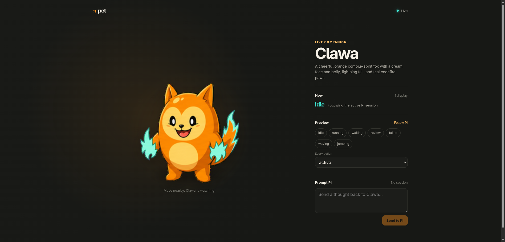

# Pi Pet

Pi Pet turns [GipPity Control](../pi-gippity-control) into an animated companion. Its bundled Clawa miniapp receives Pi activity, prompts, final replies, and realtime voice through GipPity Remote's existing browser SDK; Pi Pet contributes only pet rendering, reactions, assets, and an optional transparent Electron shell.



## Install

```bash
pi install npm:@howaboua/pi-gippity-control
pi install npm:@howaboua/pi-pet
```

Run `/gippity server` or its configured shortcut. With Pi Pet loaded, GipPity serves Clawa at `/_gippity/apps/pi-pet/` on every announced server URL. GipPity's bundled or explicitly configured main remote UI remains at `/`.

Open `<gippity-url>/_gippity/apps/pi-pet/` and accept GipPity's local certificate. The same Clawa app provides:

- working, waiting, failure, and settled animation from Pi events;
- synchronized text prompts through `GippityRemote.send()`;
- realtime conversation through `GippityRemote.audio`;
- bounded final-reply bubbles;
- local action previews and sixteen pointer-look directions.

`pet_show` is the only model tool. It triggers an intentional named reaction; routine activity animates automatically and GipPity already owns speech and final text.

Electron is optional. With no attached display, Pi Pet still publishes its versioned `{ pet, revision, action, note? }` state through GipPity alongside the session activity and tool events used by any browser renderer.

## Transparent desktop pet

The Electron shell loads the same GipPity-hosted app in a transparent, frameless, always-on-top window. It adds local cursor tracking, size, quiet mode, and snooze without another agent runtime or remote protocol.

Give the display machine an SSH alias and confirm key-based access once outside Pi:

```bash
ssh desktop true
```

The display needs npm and Node 22 or newer; runtime extraction uses PowerShell on Windows and standard `unzip` on macOS/Linux. Attach it from Pi with its LAN-reachable GipPity URL:

```text
/pet attach desktop https://192.168.0.113:43120
```

Pi now owns the running lifecycle. Its SSH command keeps the desktop source and build at `~/.pi/agent/pi-pet` on the display. On connection it compares the loaded package version and source digest with the recorded build, runs the copy, `npm install`, and `npm run build` steps only when they differ, then starts Electron. Pi or Clawa exiting stops Electron but does not discard the build. It creates no application installation, login item, or background service.

Every later Pi instance starts its attached displays automatically. Attach more SSH aliases with the same command, inspect them with `/pet status`, relaunch with `/pet restart`, or remove one with `/pet detach desktop`. SSH options, keys, proxies, and host routing stay in `~/.ssh/config`.

Electron accepts GipPity's self-signed certificate only for the configured origin. The source-only `desktop/` package is also directly runnable with `npm install`, `npm run build`, and `npm start` from a source checkout.

## Pet authoring

Authoring guides are loaded only when requested rather than exposed as permanent skills. Pass a natural-language request to the same routed command:

```text
/pet add a catching-mouse animation
/pet hatch a fluorescent office ferret
```

Pi Pet resolves `authoring/PET-GUIDE.md` from its own source or npm installation and asks Pi to follow it. That guide routes one-action work or full character hatching into the bundled references, deterministic atlas tooling, and visual review process.

Pi resolves its installed package from the guide path and runs `npm run pet:rebuild` there; authoring does not require Bun or a monorepo checkout.

Refresh the GipPity display after rebuilding assets. Pet packages remain inert JSON and bounded PNG/WebP files; they cannot supply scripts, HTML, URLs, or commands.

See [`docs/architecture.md`](docs/architecture.md), [`SECURITY.md`](SECURITY.md), and [`docs/research.md`](docs/research.md).
