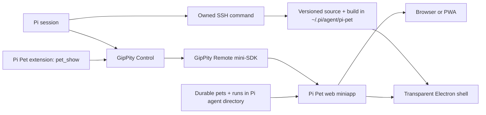

# Architecture

## Ownership

- GipPity owns the HTTPS server, active Pi session, browser events, prompts, drafts, voice, reconnection, and namespaced static delivery under `/_gippity/apps/pi-pet/`.
- `extensions/` registers Pi Pet's built web root and one bounded reaction snapshot through GipPity's remote-app bridge. It also owns configured SSH display processes for exactly the lifetime of Pi.
- `src/web/` owns catalog loading, canvas animation, pointer direction, local previews, prompt presentation, and voice controls. It uses only the hosted `GippityRemote` SDK.
- `src/desktop/` owns the transparent native window, local attention preferences, navigation confinement, and a cursor-only sandboxed preload.
- `src/protocol/` owns pet/catalog and reaction-state shapes.
- `src/pet-loader.ts` validates inert pet data and assets during builds.
- `src/pet-storage.ts` selects durable user pets from the Pi agent directory and falls back visibly to the bundled pet.
- `authoring/` is read on demand through free-form `/pet` requests; it is shipped as package data, not registered as an always-visible skill.

An attached display keeps Pi Pet at `~/.pi/agent/pi-pet` without installing an application. The SSH command compares its build record with the version and source digest of the package loaded by Pi. A mismatch updates the source and runs npm install and build; a match starts the existing build directly. Closing the SSH owner closes Electron through an inherited pipe but leaves the source and build for the next Pi session.

## State flow

GipPity sends its retained `idle`, `working`, and `settled` activity plus ordinary Pi events. The miniapp maps them onto the pet's standard actions and derives waiting/failure presentation from tool events. Settled assistant text becomes one bounded temporary bubble.

`pet_show` publishes the latest explicit reaction through the in-process remote-app bridge. Its versioned state identifies the pet catalog and carries a revision, action, and optional note. GipPity broadcasts it as `app.state` and replays the snapshot to newly connected or reconnecting renderers whether or not Electron is attached. The browser SDK requires no pet-specific transport.

## Pet flow

The npm package's `pets/` directory contains templates. Authoring copies and modifies pets under `<pi-agent-directory>/pi-pet/pets/`, keeps generation evidence under `runs/`, and writes each validated miniapp under `web/<pet-id>/`. `config.json` selects the active pet. On reload the extension serves that durable catalog and assets while refreshing the web shell from the installed package; a missing config uses bundled Clawa, while invalid user state reports a warning and visibly falls back to Clawa.
