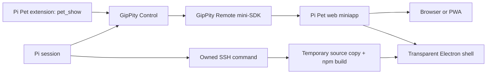

# Architecture

## Ownership

- GipPity owns the HTTPS server, active Pi session, browser events, prompts, drafts, voice, reconnection, and namespaced static delivery under `/_gippity/apps/pi-pet/`.
- `extensions/` registers Pi Pet's built web root and one bounded reaction snapshot through GipPity's remote-app bridge. It also owns configured SSH display processes for exactly the lifetime of Pi.
- `src/web/` owns catalog loading, canvas animation, pointer direction, local previews, prompt presentation, and voice controls. It uses only the hosted `GippityRemote` SDK.
- `src/desktop/` owns the transparent native window, local attention preferences, navigation confinement, and a cursor-only sandboxed preload.
- `src/protocol/` owns pet/catalog and reaction-state shapes.
- `src/pet-loader.ts` validates inert pet data and assets during builds.

An attached display receives no installed Pi Pet application. The SSH command copies desktop source from the package loaded by Pi into a temporary directory, runs its npm install and build, and starts Electron. Closing the SSH owner closes Electron through an inherited pipe and removes the source; only normal tool download caches and local attention preferences persist.

## State flow

GipPity sends its retained `idle`, `working`, and `settled` activity plus ordinary Pi events. The miniapp maps them onto the pet's standard actions and derives waiting/failure presentation from tool events. Settled assistant text becomes one bounded temporary bubble.

`pet_show` publishes the latest explicit reaction through the in-process remote-app bridge. GipPity broadcasts it as `app.state` and replays the snapshot to newly connected or reconnecting displays. The browser SDK required no pet-specific transport.

## Pet flow

The build validates `pets/clawa/pet.json`, optional `pet.pi.json`, decoded dimensions, asset paths, and frame bounds. It writes a normalized `dist/web/catalog.json` and copies referenced assets into the static miniapp.
